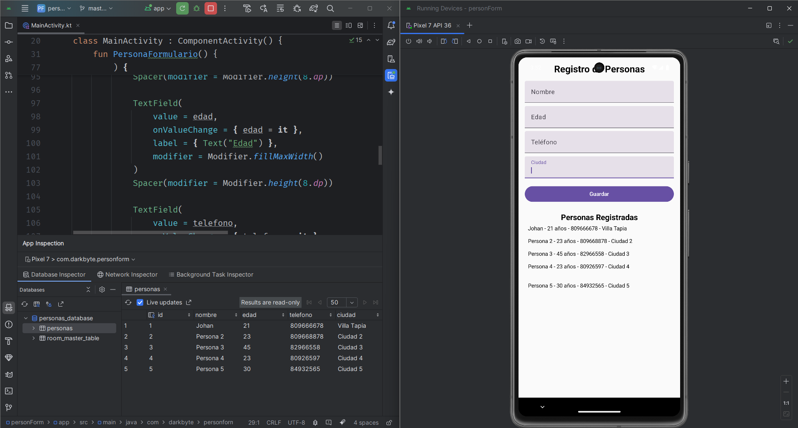

# PersonForm

Es una app creada con el fin de practicar el uso de Room y Jetpack Compose en Android, esta app equivale al 2do parcial de Programación Móvil.

## Descripción
Este proyecto consiste en una aplicación Android que permite ingresar y visualizar datos de personas (Nombre, Edad, Teléfono y Ciudad) mediante un formulario simple creado con Jetpack Compose. Los datos se almacenan en una base de datos local utilizando Room.

## Características
- Interfaz gráfica desarrollada con Jetpack Compose.
- Almacenamiento de datos en una base de datos local utilizando Room.
- Visualización de registros almacenados en tiempo real.
- Inspector de la base de datos que muestra al menos 5 registros.

## Tecnologías Utilizadas
- Android Studio
- Kotlin
- Jetpack Compose (Interfaz de usuario declarativa).
- Room (Jetpack Library) para persistencia de datos.

## Instalación
1. Clona este repositorio:
```bash
   git clone git@github.com:jrvdev/personForm.git
```
2. Abre el proyecto en Android Studio.
3. Compila y ejecuta el proyecto en un emulador o dispositivo físico.

## Uso
1. Ejecuta la aplicación.
2. Ingresa los datos requeridos (Nombre, Edad, Teléfono y Ciudad).
3. Presiona el botón de guardar para almacenar el registro en la base de datos.
4. Visualiza la lista de registros almacenados.

## Capturas


## Autor
Johan Ramirez Vargas 


