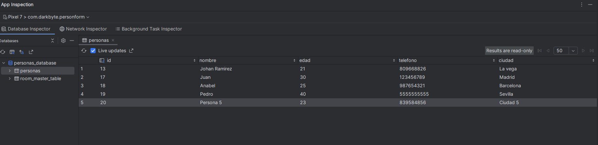
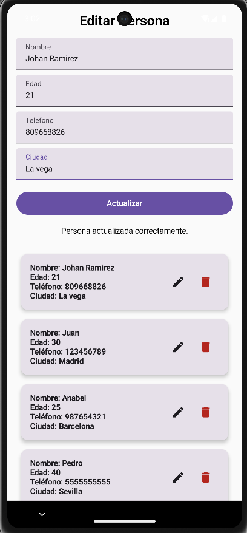
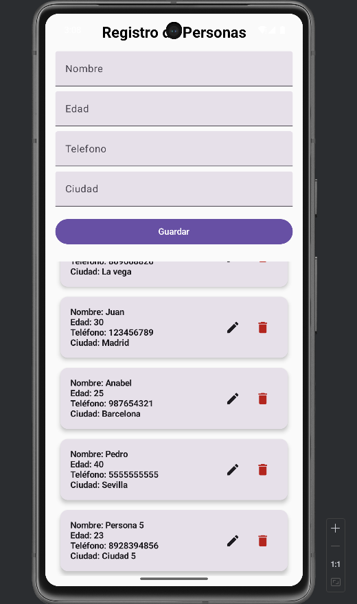
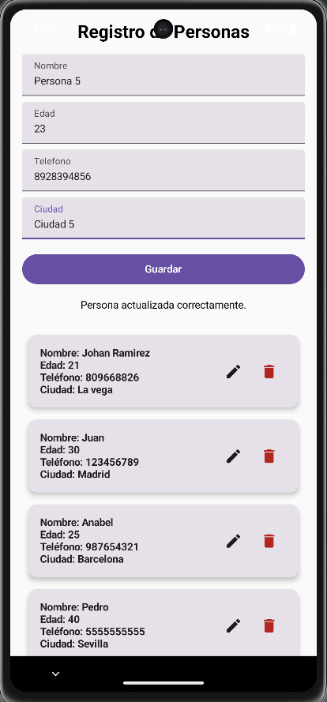

# PersonForm

Es una app creada con el fin de practicar el uso de Room y Jetpack Compose en Android, esta app equivale al 2do parcial de Programación Móvil.

## Descripción
Este proyecto consiste en una aplicación Android que permite ingresar, editar, eliminar y visualizar datos de personas (Nombre, Edad, Teléfono y Ciudad) mediante un formulario interactivo creado con Jetpack Compose. Los datos se almacenan en una base de datos local utilizando Room y se gestionan eficientemente mediante un ViewModel con StateFlow.

## Características
- **Interfaz gráfica**: Desarrollada con Jetpack Compose, permitiendo una experiencia de usuario moderna y fluida.
- **Almacenamiento local**: Utiliza Room para persistir los datos de las personas.
- **Gestión de datos**: Funcionalidad para agregar, editar y eliminar registros.
- **Visualización en tiempo real**: Los registros almacenados se muestran y actualizan en tiempo real.
- **Validación de formularios**: Se incluyen validaciones para asegurar que los datos introducidos sean correctos, como el formato del teléfono.
- **Optimización del ViewModel**: Utiliza StateFlow para gestionar los estados de la interfaz de usuario de manera eficiente.

## Tecnologías Utilizadas
- **Android Studio**
- **Kotlin**
- **Jetpack Compose**: Para la interfaz de usuario declarativa.
- **Room**: Para la persistencia de datos en la base de datos local.
- **ViewModel** y **StateFlow**: Para gestionar el estado de la interfaz y la lógica de la app de manera reactiva.

## Instalación
1. Clona este repositorio:
```bash
   git clone git@github.com:jrvdev/personForm.git
```
2. Abre el proyecto en Android Studio.
3. Compila y ejecuta el proyecto en un emulador o dispositivo físico.

## Uso
1. Ejecuta la aplicación.
2. Ingresa los datos requeridos (Nombre, Edad, Teléfono y Ciudad).
3. Presiona el botón de guardar para almacenar el registro en la base de datos.
4. Visualiza la lista de registros almacenados.
5. Edita o elimina registros existentes si es necesario.

## Capturas de la App

### Base de datos


### Editar Personas


### Listar Personas


### Agregar Personas


## Autor
Johan Ramirez Vargas